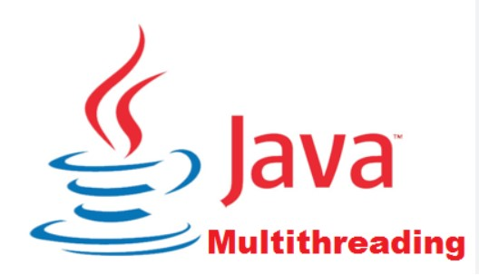
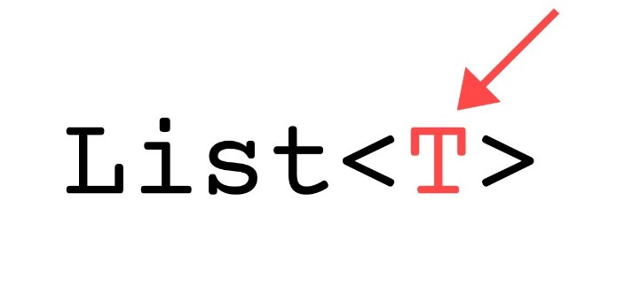

# Java Full Stack & Data Science Portfolio
---
## Java Full Stack
### Finance Desk : Risk Systems

Working with major investment bank since Mar 2022 to till date to re enginner services involved FD Risk systems.

---
### Issuing Solutions

Contributed over 9 years(2013-2022) on Worldline Pay Issuer Back-Office (WL Pay IBO) product which is a proven card management system that addresses the needs of various types of issuers: incumbent banks, challenger banks and regulated fintechs.

---
## POCs & Tutorials
### MEDIMANAGE:Medical shop Managment system

A Medical Shop Management System is software designed to streamline and automate the various tasks and operations of a pharmacy or medical store.
It helps manage inventory, sales, customer records, prescriptions, and other administrative functions efficiently.

---

### Multi threading in Java with Examples

Created a repository to demonstrate various topics in Java multi threading such as need of multithreading, thread joining,locks,using synchronization, Executor framework,callable,completable future in java

---
### Generics usage in Java with Examples

Created a repository to demonstrate various topics in Java Generics such as Generic classes and Interfaces, Inheritance Type, using wild cards,Bounded type parameters,generic collections.

